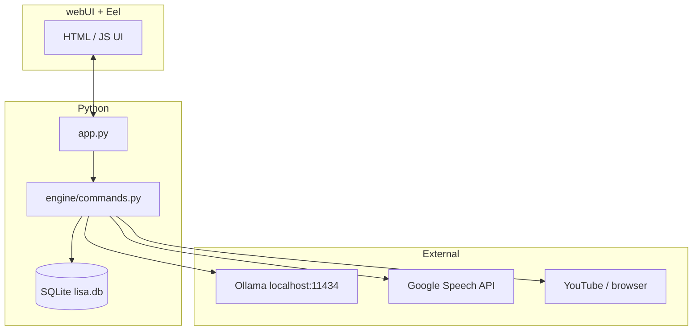

# L.I.S.A — Lightweight Intelligent System Assistant

Prototype **desktop assistant**: a **Python** backend exposes speech-driven commands through **Eel** (embedded Chromium UI), shortcuts stored in **SQLite**, and an **Ollama** HTTP chat endpoint for open-ended questions when fixed intents do not apply.

This is early-stage research code (wake-word UX, edge deployment, and robust NLU are intentionally lightweight).

## Features

| Area | Behavior |
|------|-----------|
| **Voice input** | `SpeechRecognition` captures microphone audio and transcribes with Google’s web API (`recognize_google`) |
| **Launch intents** | Opens apps or URLs resolved from SQLite tables (`sys_command`, `web_command`) |
| **Media** | YouTube playback helpers via **pywhatkit** (`handle_youtube`) |
| **Open-ended QA** | Posts to **Ollama** `POST /api/chat` using model **`llama3.2:1b`** (`engine/commands.py`) |

Frontend assets live under **`webUI/`** (`index.html`, `script.js`, `controller.js`, styles).

## Architecture



Constants (`ASSISTANT_NAME`, `API_ENDPOINT`) live in **`engine/constants.py`**.

## Prerequisites

- **Python 3.10+**
- **Microsoft Edge** installed — `app.py` launches Edge in app mode pointing at `http://localhost:8000/index.html` (**Windows-oriented** entrypoint today).
- **Microphone** access for voice commands.
- **[Ollama](https://ollama.com/)** running locally with a compatible model pulled (defaults assume **`llama3.2:1b`**; change `engine/commands.py` if you use another tag).

## Setup

```bash
python -m venv .venv
.\.venv\Scripts\activate          # Windows — use `source .venv/bin/activate` on Unix
pip install -r requirements.txt
```

**PyAudio** sometimes needs platform-specific installation steps (especially Linux); follow your OS docs if `pip install PyAudio` fails.

For app/web shortcuts resolved from the database, create **`sys_command`** and **`web_command`** tables (example DDL is commented in **`engine/db.py`**). Until those tables exist, DB-backed “open …” flows may fail while voice + Ollama paths still work.

## Run

```bash
python app.py
```

The desktop UI opens via Edge; Eel serves `webUI/index.html` on **localhost**.

To change LLM behavior, edit **`query_llama`** in `engine/commands.py` (model name, endpoint URL).

## Repository layout

| Path | Purpose |
|------|---------|
| `app.py` | Eel bootstrap + browser launch |
| `engine/commands.py` | Speech loop, intents, Ollama integration |
| `engine/features.py`, `engine/speak.py`, … | Audio/UI helpers |
| `webUI/` | Static frontend |

## License

Apache License 2.0 — see [`LICENSE`](LICENSE).
